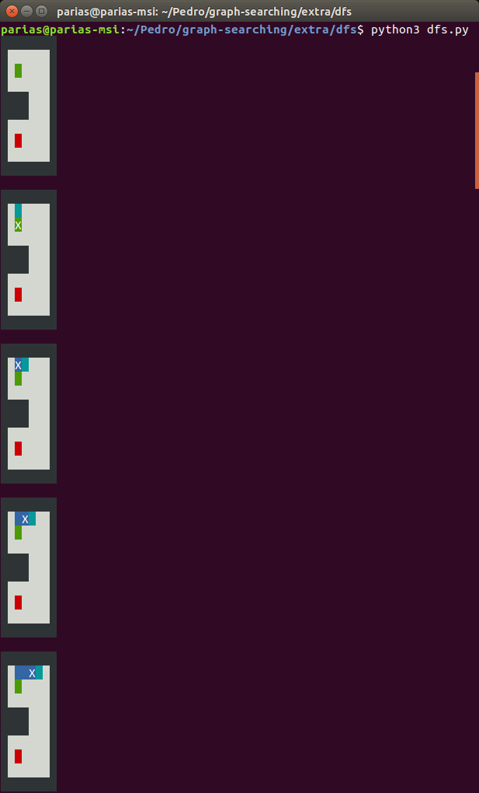
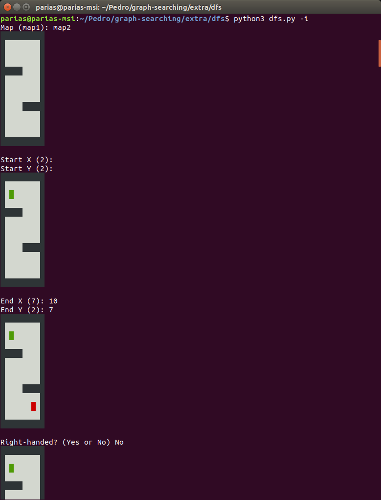
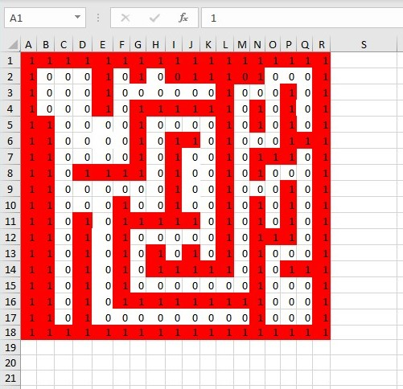

# Entrega: Implementación de algoritmo básico
Este repositorio contiene la implementación de los diferentes algoritmos junto con los extras realizados. Asimismo, este fichero explica el trabajo realizado, la estructura del repositorio y las instrucciones para su ejecución.

Autor: **Pedro Arias Pérez**

Link: [pariaspe/graph-searching](https://github.com/pariaspe/graph-searching)


## Índice
- [1. Descripción](#descripción)
- [2. Estructura de Carpetas](#estructura-de-carpetas)
- [3. Extras](#extras)
    - [3.1. Extra 1](#extra-1-visualización-y-resumen)
    - [3.2. Extra 2](#extra-2-algoritmo-interactivo)
    - [3.3. Extra 3](#extra-3-comparación-de-algoritmos)
    - [3.4. Extra 4](#extra-4-mapa-laberinto)

---

## Descripción
- **Base**:
    1. **BFS.** Nota: He modificado levemente el código para que no haya que cambiar la ruta del mapa al cambiar el equipo.
    2. **Algoritmo greedy (DFS).** Notas: He tratado de modificar al mínimo el código inicial de BFS. El algoritmo es a derechas y utiliza una FIFO para almacenar los nodos e ir recorriendo el mapa.

- **Extra**:
    1. Mejora de visualización y resumen de ejecución.
    2. Algoritmo interactivo.
    3. Comparación de algoritmos.
    4. Mapa laberinto.


## Estructura de carpetas
```
.
+-- doc (img...)
+-- base
    +-- bfs
        +-- main.py
    +-- dfs
        +-- main.py
+-- extra
    +-- bfs
        +-- bfs.py
    +-- dfs
        +-- dfs.py
    +-- utils.py
    +-- compare.py
    +-- comparation.txt
+-- README.md
```

## Extras
### Extra 1: Visualización y Resumen
Se le ha dado formato al texto que se imprime por la terminal. De esa forma, haciendo uso de caracteres ANSI se puede mejorar la visualizaciṕn sin necesidad de una usar una librería externa.
Para ello se ha reestructurado el código en distintas clases, creando varias nuevas, que se encuentran en el fichero utils.py. Los distintos algoritmos utilizan métodos y clases de este fichero.

Código de colores:
- 0: libre -> blanco
- 1: obstáculo -> negro
- 2: visitado -> azul
- 3: start -> verde
- 4: goal -> rojo
- actual -> azul con X intermitente
- nueva -> cian

Además, tras la ejecuciónse muestra un pequeño resumen que recoge parámetros importantes del algoritmo, como la longitud de la ruta encontrada, el número de celdas accedidas o el tiempo de ejecución.

```
%%%%%%%%%%%%%%%%%%%%%%%%%%%%%%%%%%
%%           RESULTS            %%
%%%%%%%%%%%%%%%%%%%%%%%%%%%%%%%%%%

Route 	 Cells 	
Length	Checked	  Time
--------------------------------
  72	    398	   0.05704
```


Ficheros necesarios: `extra/utils.py` + `extra/[alg]/[alg].py` (ej: bfs.py, dfs.py)

Ejemplo de ejecución:
```
$ cd extra/bfs
$ python3 bfs.py
```



### Extra 2: Algoritmo interactivo
Todos los algoritmos admiten argumentos a la hora de ejecutarlos mediante la línea de comandos. Estos argumentos permiten modificar el funcionamiento base de los algoritmos.
Estas opciones se pueden visualizar con el argumento `-h`.

```
$ cd extra/dfs
$ python3 dfs.py -h
usage: dfs.py [-h] [-m MAP] [-s N N] [-e N N] [-i] [-k] [-o OUTPUT]

Depth First Search Algorithm.

optional arguments:
  -h, --help           show this help message and exit
  -m MAP, --map MAP    change map folder
  -s N N, --start N N  change start point
  -e N N, --end N N    change end point
  -i                   interactive mode (choose map, start, end...)
  -k                   set counter clockwise (left-handed)
  -o OUTPUT            output mode (choose from none, base, colored)
```

**Opciones**

| argument | option | example |
| --- | ------- | ------- |
| -h, --help | display help message and exit | `python3 dfs.py -h` |
| -m MAP, --map MAP | use map MAP | `python3 dfs.py -m map5` |
| -s X Y, --start X Y | use [X][Y] as start point | `python3 dfs.py -s 2 2` |
| -e X Y, --end X Y | use [X][Y] as end point | `python3 dfs.py -e 10 7` |
| -i | enter interactive mode | `python3 dfs.py -i` |
| -k | set counter-clockwise | `python3 dfs.py -k` |
| -o [none, base, colored] | use OUTPUT mode | `python3 dfs.py -o base` |


**OJO**: La opción `-k` solo está disponible para el algoritmo DFS.



### Extra 3: Comparación de algoritmos
Para comparar los algoritmos se ha creado un fichero (`compare.py`) que ejecuta los algoritmos sobre los distintos mapas y muestra los parámetros más relevantes como el número de accesos a casillas del mapa, el tamaño de la ruta encontrada por el algoritmo o el tiempo de ejecución.
Para ejecutar esta comparación, es tan sencillo como lanzar el fichero `compare.py`:
```
$ cd extra
$ python3 compare.py
```

La salida de esta ejecución se volcado al archivo de texto `comparation.py` donde se puede comprobar los resultados obtenidos. La comparación aquí expuesta se ha realizado sobre todos los mapas que se han facilitado con el material para la práctica. La intención es tener un espectro de pruebas amplio que permita obtener unos resultados generales, y que no dependan de la configuración específica de un mapa en particular.

```
%%%%%%%%%%%%%%%%%%%%%%%%%%%%%%%%%%
%%           TOTAL              %%
%%%%%%%%%%%%%%%%%%%%%%%%%%%%%%%%%%

    	Route    Cells 	
Alg.	Length  Checked    Time
--------------------------------
BFS	 410	  13492	1.72058
DFSR	1176	 10641	1.43472
DFSL	1242	  4933	0.86646

%%%%%%%%%%%%%%%%%%%%%%%%%%%%%%%%%%
%%          RANKINGS            %%
%%%%%%%%%%%%%%%%%%%%%%%%%%%%%%%%%%

                LESS
     SHORTEST  CHECKS  FASTEST
--------------------------------
map1	BFS	 DFSr	BFS
map2	BFS	 DFSl	DFSl
map3	BFS	 DFSl	DFSl
map4	BFS	 DFSl	DFSl
map5	BFS	 DFSr	DFSr
map6	BFS	 DFSl	DFSl
map7	BFS	 DFSl	DFSl
map8	BFS	 DFSl	DFSr
map9	BFS	 DFSl	DFSl
map10   BFS	 DFSl	DFSl
map11   BFS	 DFSr	DFSr
--------------------------------

	SHORTEST ROUTE
--------------------------------
1º: BFS (11)

	LESS CELLS CHECKED
--------------------------------
1º: DFSl (8)
2º: DFSr (3)

	FASTEST ALGORITHM
--------------------------------
1º: DFSl (7)
2º: DFSr (3)
3º: BFS (1)
```

Sobre estas estadísticas se quiere hacer una reflexión sobre las fortalezas y debilidades de los algoritmos analizados. La comparación es principalmente sobre BFS frente a DFS, aunque también hacemos una distinción entre DFS a derechas (DFSr) o a izquierdas (DFSl).

En primer lugar, y como era obvio esperar, el camino más corto se obtiene siempre con el algoritmo BFS. Un algoritmo exhaustivo va a encontrar siempre que exista el camino óptimo (más corto). Por tanto, un algoritmo greedy podrá como mucho empatar y encontrar el mismo camino. Sin embargo, como podemos observar esto no ocurre en ninguna ocasión. Además, en los datos estadísticos totales mostrados, se puede observar como la ruta total acumulada encontrada es de 410 en BFS frente a los ~1.200 en DFS, prácticamente el triple.

Encontrar el camino óptimo supone acceder a un mayor número de celdas que un algoritmo greedy. Esto también coincide con lo esperado, pues un algoritmo en anchura (como también se conoce a los algoritmos exhaustivos) recorre más casillas del mapa que uno en profundidad. Esto se puede observar en los datos estadísticos totales, donde BFS duplica a DFS en número de casillas accedidas (+13k frente a ~7.5k).

Con respecto al tiempo de ejecución, se observa que los algoritmos en profundidad suelen ser más rápidos que los algoritmos en anchura. Solo en uno de los once mapas el algoritmo más rápido es un BFS. Esto se puede deber a que el mapa en cuestion (`map1`) es un mapa muy pequeño, por lo que las diferencias entre algoritmos no son grandes. Esto coincide con que, como se acaba de mencionar, los algoritmos en anchura acceden a un número muy superior de casillas que repercute en el tiempo de ejecución. Observando los tiempos de ejecución en los mapas de muestra podemos ver como el algoritmo BFS casi dobla en tiempo a los algoritmos DFS (1.72s frente a ~1.1s).

Por último, es interesante mencionar que en los mapas seleccionados para esta comparación se observa una cierta tendencia de izquierdas, pues los resultados obtenidos con el algoritmo DFS a izquierzas (DFSl) son ligeramente mejores a los obtenidos con un DFS a derechas (DFSr).

Como conclusión, si se dispone del suficiente tiempo para planificar el movimiento sería más interesante utilizar un algoritmo como BFS, pues eso supondría que el robot realizase la ruta más corta lo que influye en aspectos tan importantes como la autonomía energética del robot.
Sin embargo, si se dispone de un tiempo de planificación límitado, sería más interesante utilizar un algoritmo como DFS, pues lo tiempos podrían llegar a reducirse a la mitad, como se ha observado en esta pequeña prueba experimental.


### Extra 4: Mapa Laberinto
Los mapas existentes son todos bastante abiertos, así que por comprobar como se comportan los algoritmos en un mapa más enrevesado he creado un laberinto.
Los ficheros de este nuevo mapa se encuentran en el directorio `lab1`.

- Punto de inicio: 2, 2
- Punto de final: 15, 15



Comparando ambos algoritmos, se obtienen los siguientes resultados:
```
%%%%%%%%%%%%%%%%%%%%%%%%%%%%%%%%%%
%%		    lab1	          %%
%%%%%%%%%%%%%%%%%%%%%%%%%%%%%%%%%%

    	Route 	 Cells 	
Alg.	Length	Checked   Time
---------------------------------
BFS	   60	    563	0.03758
DFSr	  72	    398	0.03582
DFSl	  74	    375	0.0336

Shortest -------> BFS (60)
Less checks ----> DFSl (375)
Fastest --------> DFSl (0.0336)
```

TODO: explicar resultados
